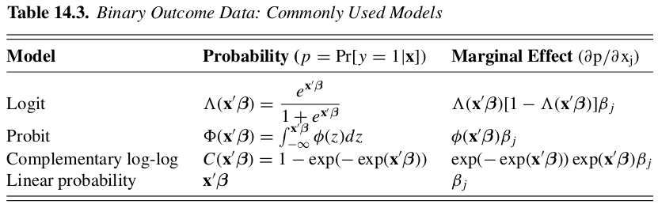

```{r setup, include=FALSE}
knitr::opts_chunk$set(echo = TRUE)
```

```{r inst, message=FALSE}
library(data.table)
library(fixest)
library(kableExtra)
library(modelsummary)
library(hdm)
library(ggplot2)
```

```{r dt-utils, echo=FALSE}
source("dt_utils.R")
```

# Selection on Observables Framework

Now we will depart from experiments and start to use **observational data** to infer causality. In that case, we need the treatment assignment mechanism to be regular. There are 3 conditions that an assignment mechanism must satisfy in order to be considered regular:

1. Individualistic assignment: This limits the dependence of a particular unit's assignment probability on the values of covariates and potential outcomes for other units.

An assignment mechanism $\operatorname{Pr}(\mathbf{W} \mid \mathbf{X}, \mathbf{Y}(0), \mathbf{Y}(1))$ is individualistic if, for some function $q(\cdot) \in[0,1],$ 

$$
p_{i}(\mathbf{X}, \mathbf{Y}(0), \mathbf{Y}(1))=q\left(X_{i}, Y_{i}(0), Y_{i}(1)\right), \text { for all } i=1, \ldots, N
$$

and

$$
\operatorname{Pr}(\mathbf{W} \mid \mathbf{X}, \mathbf{Y}(0), \mathbf{Y}(1))=c \cdot \prod_{i=1}^{N} q\left(X_{i}, Y_{i}(0), Y_{i}(1)\right)^{W_{i}}\left(1-q\left(X_{i}, Y_{i}(0), Y_{i}(1)\right)\right)^{1-W_{i}}
$$

for $(\mathbf{W}, \mathbf{X}, \mathbf{Y}(0), \mathbf{Y}(1)) \in \mathbb{A},$ for some set $\mathbb{A},$ and zero elsewhere ($c$ is the constant that ensures that the probabilities sum to unity).

2. Probabilistic assignment: This requires the assignment mechanism to imply a nonzero probability for each treatment value, for every unit.

An assignment mechanism $\operatorname{Pr}(\mathbf{W} \mid \mathbf{X}, \mathbf{Y}(0), \mathbf{Y}(1))$ is probabilistic if the probability of assignment to treatment for unit i is strictly between zero and one: 

$$
0<p_{i}(X_i, Y_i(0), Y_i(1))<1, \text { for each possible } \mathbf{X}, \mathbf{Y}(0), \mathbf{Y}(1)
$$
for all $i=1, \ldots, N.$

3. Unconfounded assignment: This disallows dependence of the assignment mechanism on the potential outcomes.

An assignment mechanism is unconfounded if it does not depend on the potential
outcomes:
\begin{equation*}
\operatorname{Pr}(\mathbf{W} \mid \mathbf{X}, \mathbf{Y}(0), \mathbf{Y}(1))=\operatorname{Pr}\left(\mathbf{W} \mid \mathbf{X}, \mathbf{Y}^{\prime}(0), \mathbf{Y}^{\prime}(1)\right)
\end{equation*}
for all $\mathbf{W}, \mathbf{X}, \mathbf{Y}(0), \mathbf{Y}(1), \mathbf{Y}^{\prime}(0),$ and $\mathbf{Y}^{\prime}(1)$

The unconfounded assumption is also known as the conditional independence assumption -- CIA, [@Angrist2008]. Thus, if the assignment mechanism is uncounfounded and individualistic the probability of assignment is the _individual_ propensity score. Also, given individualistic assignment, a mechanism that is both probabilistic and uncounfounded is referred as _strongly ignorable treatment assignment_. 


@Imbens2015b lays out an overall strategy for flexibly and robustly
estimating the average effect of the treatment. The strategy consists of two,
sometimes three, distinct stages to estimate the average treatment effect from observational studies. The first stage is referred as the _design stage_ where the full sample is trimmed to improve overlap of covariates. In the second stage, a _supplementary analysis_ of the unconfoundedness assumption is assessed. Finally, the third stage is the _analysis stage_, where the estimator of choice is applied to the trimmed data set and the average effect is thus estimated. 

# Design Stage

In this stage **do not use the outcome data** and focus solely on the treatment indicators and covariates, $(X,W)$. This stage does not involve the outcome data and as a result, this analysis cannot be "contaminated" by knowledge of estimated outcome distributions, or by preferences, conscious or unconcious, for
particular results.

## Initial Covariate's Balance

We will use once again the "schools" dataset.

```{r read, cache=TRUE}
dt <- fread("Data/cps_union_data.csv")
#' Cleaning. Do not use the outcome!
dt[, c("earnings", "V1", "CPSID", "CPSIDP", "public_housing", "employed") := NULL]
dt[, `:=`(
  marital_status = ifelse(marital_status %in% c(1, 2), 1, 0),
  race = ifelse(race == 1, 1, 0),
  age_2 = age^2
)]
cat_cols <- c("class_of_worker", "class_of_worker_last_year")
dt[, (cat_cols) := lapply(.SD, factor), .SDcols = cat_cols]
dt <- dt[complete.cases(dt)]
```

```{r init-bal, results = "asis"}
datasummary_balance(~union, data = dt,
                    title =  "Descriptive statistics by treatment group for an observational study.")
```

@Imbens2015 point that the goal is, at least at this point, to assess whether the differences between the two sample distributions are so large that simple adjustment methods are unlikely to remove biases in estimated treatment/control average differences. So, they suggest reporting the **normalized differences**:

\begin{equation} 
\hat\Delta_{ct}= \frac{\bar X_t - \bar X_c}{\sqrt{(s^2_t+s^2_c)/2}}
\end{equation}

where $\bar X_t$ and $\bar X_c$ denote the sample means for treatment and control groups, $s^2_t$ and $s^2_c$ are the sample variances. They claim that, given a large enough sample size, the t-statistic of the difference in means will always be high enough reject the null hypothesis, whereas the normalized difference, $\hat\Delta_{ct}$ remains unchanged when the sample size increases. The challenge of adjusting for differences in the covariates should be simpler when one has more observations, but that is not what a t-test is telling us. An extra benefit of the normalized difference is that it is expressed in standard deviation units. Differences of 0.25 or less seem to indicate good balance[^ttest].

[^ttest]: I refer you to the following reading: [Should we require balance t-tests of baseline observables in randomized experiments?](https://blogs.worldbank.org/impactevaluations/should-we-require-balance-t-tests-baseline-observables-randomized-experiments)

We may also wish to compare measures of dispersion in the two distributions. This can be done with the **logarithm of the ratio of standard deviations**, which is invariant to scale:

$$\hat\Gamma_{ct}=\ln(s_t)-\ln(s_c)$$

A second approach to comparing distributions, one can investigate what fraction of the treated (control) units have covariate values that are in the tails of
the distribution of the controls (treated). For example, we can compute the probability mass of the covariate distribution for the treated that is **outside** the $1−\alpha/2$ and the $\alpha/2$ quantiles of the covariate distribution for the controls:

$$\hat\pi_t^\alpha=\left(1-\left(\hat F_t(\hat F_c^{-1}(1-\alpha/2))\right)+\hat F_t(\hat F_c^{-1}(\alpha/2))\right)$$

and the analogous quantity for the control distribution:

$$\hat\pi_c^\alpha=\left(1-\left(\hat F_c(\hat F_t^{-1}(1-\alpha/2))\right)+\hat F_c(\hat F_t^{-1}(\alpha/2))\right)$$

where $\hat F_c(\cdot)$ and $\hat F_t(\cdot)$) are the empirical distribution function of a covariate in the control and treated subsamples, respectively:

$$\hat F_j(x)=\frac{1}{N_j}\sum_{W_i\in j}\mathbf{1}_{X_i}\leq x\, , \quad\text{for } j\in\{c, t\}$$
and the $\hat F^{-1}(\cdot)$ denotes the quantile function of the empirical distribution.

```{r norm-diff, cache=TRUE}
# Compute the normalized difference
norm_diff <- function(xt, xc, sdt, sdc) {
  (xt - xc)/(sqrt((sdt^2 + sdc^2)/2))
}

coverage <- function(dt, treat_var, variables, values, alpha = 0.05) {
  stopifnot(is.data.table(dt))

    quantiles <- dt[, by = .(get(treat_var), get(variables)),
                   lapply(.SD, function(x){
                     c(quantile(x, 1 - alpha/2),
                       quantile(x, alpha/2)
                     )
                   }),
                   .SDcols = values
  ][, q := rep(c("high", "low"), .N/2)]
    
  quantiles <- dcast(quantiles, get+get.1~q, value.var = "value")
  setnames(quantiles, c("get", "get.1"), c(treat_var, variables))
  quantiles[, not_treat_var := 1*(!get(treat_var))]
  
  pi_dt <- merge(dt_long, quantiles[, !c(..treat_var)], 
                  by.x = c(treat_var, variables),
                  by.y = c("not_treat_var", variables),
                  all.x = TRUE)
  pi_dt <- pi_dt[, by = .(get(treat_var), get(variables)),
         .(pi = (1 - mean(value <= high)) + mean(value <= low))]
  pi_dt <- dcast(pi_dt, get.1~get, value.var = "pi")
  setnames(pi_dt, c("get.1", "0", "1"), c(variables, "pi_cont", "pi_treat"))
  return(pi_dt)
}
# Select the numerical columns and compute the normalized difference and log
# ratio
num_cols <- colnames(dt)[sapply(dt, is.numeric)]

dt_long <- melt(dt[, ..num_cols], id.vars = "union",
                variable.factor = FALSE)

dt_summa <- dt_long[, by = .(variable, union),
                   .(N = .N,
                     mean = mean(value, na.rm = TRUE),
                     sd = sd(value, na.rm = TRUE)
                     )]
dt_wide <- dcast(dt_summa, variable~union, 
                 value.var = c("mean", "sd", "N"))
dt_wide[,  `:=`(
  diff_mean = mean_1 - mean_0,
  std_err = sqrt(sd_1^2/N_1 + sd_0^2/N_0),
  t_stat = (mean_1 - mean_0)/sqrt(sd_1^2/N_1 + sd_0^2/N_0),
  norm_diff = norm_diff(mean_1, mean_0, sd_1, sd_0),
  log_ratio = log(sd_1) - log(sd_0)
) ]

pi_dt <- coverage(dt_long, treat_var = "union", 
                  variables = "variable", 
                  values = "value")
# Join coverages to dt_wide
bal_dt <- dt_wide[pi_dt, on = "variable"]
# Reorder the columns by their index
vari <- which(colnames(dt_wide) == "variable")
treat <- grep("_1", colnames(dt_wide))
cont <- grep("_0", colnames(dt_wide))
setcolorder(bal_dt, c(vari, treat, cont))
```

And now we can present the normalized difference alongside to other metrics in the balance table.


```{r norm-tbl, results = "asis"}
Nt <- bal_dt[1, N_1]
Nc <- bal_dt[1, N_0]
t_title <- sprintf("Treatment ($N_t = %s$)", Nt)
c_title <- sprintf("Control ($N_c = %s$)", Nc)
kbl_head <- c(1, 2, 2, 5)
names(kbl_head) <- c(" ", t_title, c_title, "Overlap Measures")

kbl(bal_dt[, -c("N_1", "N_0", "diff_mean", "std_err")], 
    digits = 2,
    col.names = c("Variable", "Mean", "Std.Dev",
                  "Mean", "Std.Dev",
                  "t-stat", "Norm. Diff.", "Log Ratio", "$\\pi_c^{0.05}$", "$\\pi_t^{0.05}$"),
    escape = FALSE) |> 
  kable_classic(full_width = FALSE) |> 
  add_header_above(header = kbl_head)
```

Since we have multiple covariates, it is also useful to understand their joint distribution. In this case we want to have a single measure of the difference between the treatment arms distributions. Let $K$ be the number of covariates, the
number of components of the vector of pre-treatment variables $X_i$, then we have $K$-vectors for sample means, $\bar X_t$ and $\bar X_c$, and $K\times K$ covariance matrices, $\hat\Sigma_t$ and $\hat\Sigma_c$.

$$
\hat\Sigma_j=\frac{1}{N_j-1}\sum_{i\in j}(X_i-\bar X_j)(X_i-\bar X_j)\prime
$$

And that single measure we are seeking for is the Mahalanobis distance:

$$
\hat\Delta_{ct}^{mv}=\sqrt{(\bar X_t-\bar X_c)\prime\left(\frac{\hat\Sigma_c+\hat\Sigma_t}{2}\right)^{-1}(\bar X_t-\bar X_c)}
$$

```{r mahalo}
means <- dt[, ..num_cols
             ][, by = union, 
               lapply(.SD, mean, na.rm = TRUE)]
covars <- dt[, ..num_cols
             ][, by = union,
               .(sigma = list(var(.SD, na.rm = TRUE)))] 
# Average of Sigma matrices
m_sig <- (covars$sigma[[1]] + covars$sigma[[2]])/2
# Use unlist to convert data.table rows into vectors
mahalo <- mahalanobis(unlist(means[union == 1, -c("union")]),
                      unlist(means[union == 0, -c("union")]),
                      m_sig)
mahalo
```


## Propensity Score

Here we focus on the statistical problem of estimating the **conditional probability of receiving the treatment** given the observed covariates. The end goal is to obtain estimates of the propensity score that balance the covariates between treated and control subsamples. The propensity score in the _design stage_ is useful to trim the data set in order to improve covariate's balance.

We have seen in class that the propensity score is a balancing score and those have an important property: treatment assignment is unconfounded when conditioned on a balancing score:

$$W_i\perp Y_i(0), Y_i(1)|e(X_i)$$

and the propensity score is the probability of being assigned to treatment given the full set of observed covariates:

$$e(X_i)=Pr(W_i=1|X_i)$$

Typical binary outcome models used to estimate a propensity score are, [@cameron2005microeconometrics]:

```{r bin_out, echo=FALSE}

```

We will proceed to the following section estimating logit models.

### Covariate's selection for PS estimation

Before estimating the propensity score, the researcher must specify wich covariates and their transformations enter the vector $X$. It may not be sufficient to include them only linearly, but also, we do not want to be too flexible in the specification and risk to incur in overfitting, which will spoil the overlap assumption.

So we must have a principled method to select variables to be included in the propensity score that is able to balance between the two forces discussed. @Imbens2015 propose a stepwise procedure for selecting covariates and high-order terms[^sw], but also there is a growing literature on automatic selection, mainly using the Lasso algorithm, @hastie2019statistical and @belloni2017program .

[^sw]: Be warned. In all my tests, even with a moderate sized dataset this procedure is extremely inefficent and slow.

_Stepwise Selection_

```{r sw-func}
#' Stepwise model selection - Imbens and Rubin -----------------------------
#' Imbens and Rubin's stepwise selection algorithm
#' treatment: character variable for treatment indicator variable
#' Xb: character vector with names of basic covariates: you may pass it as c() 
#' if you do not want any basic covariate
#' Xt: character vector with names for covariates to be tested for inclusion
#' data: dataframe with variables
#' Clinear: threshold, in terms of likelihood ratio statistics, for inclusion of
#' linear terms
#' Cquadratic: threshold, in terms of likelihood ratio statistics, for inclusion
#' of quadratic/interaction terms
#' Intercept: does the model include intercept?
#' Author: Luis Alvarez
#' Modifications: Rafael F. Bressan
ir_stepwise <- function(treatment, Xb, Xt, data, 
                        Clinear = 1, 
                        Cquadratic = 2.71, 
                        intercept = TRUE)
{
  #Add or not intercept
  if (intercept)
    inter.add = "1" 
  else inter.add = "-1"
    
  #Formula for model
  if (length(Xb) == 0)
    formula <- paste(treatment, inter.add, sep = " ~ ") 
  else formula <- paste(treatment, paste(c(inter.add,Xb), collapse = " + "), 
                       sep = " ~ ")
  
  continue <- TRUE
  Xt_left <- Xt
  # First order inclusion
  while (continue) {
    null.model <- fixest::feglm(as.formula(formula), data, family = "binomial")
    null.lkl <- logLik(null.model)
    test.stats <- c()
    for (covariate in Xt_left)
    {
      formula.test <-  paste(formula, covariate, sep = " + ")
      test.model <- fixest::feglm(as.formula(formula.test), data, 
                                family = "binomial")
      
      lkl.ratio <- 2*(logLik(test.model) - null.lkl)
      test.stats <- c(test.stats, lkl.ratio)
    }
    
    if (max(test.stats,na.rm = TRUE) < Clinear)
      continue <- FALSE 
    else {
      add.coef <- Xt_left[which.max(test.stats)]
      formula <- paste(formula, add.coef, sep = " + ")
      Xt_left <- Xt_left[-which.max(test.stats)]
    }
    
  }
  
  #Defining Xstar set. Set of first order included variables
  Xstar <- c(Xb, Xt[!(Xt %in% Xt_left)])
  
  #Creating all combinations of Xstar interactions
  combinations <- expand.grid(Xstar, Xstar)
  Xcomb <- paste(combinations[,1],combinations[,2],sep = ":")
  continue <- TRUE
  Xcomb_left <- Xcomb
  
  while (continue) {
    null.model <- fixest::feglm(as.formula(formula), data, family = "binomial")
    
    null.lkl <- logLik(null.model)
    
    test.stats <- c()
    for (covariate in Xcomb_left)
    {
      formula.test <- paste(formula, covariate, sep = " + ")
      test.model <- fixest::feglm(as.formula(formula.test), data, 
                                family = "binomial")
      lkl.ratio <- 2*(logLik(test.model) - null.lkl)
      test.stats <- c(test.stats, lkl.ratio)
    }
    
    if (max(test.stats,na.rm = TRUE) < Cquadratic)
      continue <- FALSE 
    else {
      add.coef <- Xcomb_left[which.max(test.stats)]
      formula <- paste(formula, add.coef, sep = " + ")
      Xcomb_left <- Xcomb_left[-which.max(test.stats)]
    }
  }
  
  return(list(formula = formula, inc_x = Xstar))
}
```

The stepwise method asks for a _basic_ set of covariates, $X_b$, which will always be included in the specification and an additional set of covariates, $X_t$, that should be tested for inclusion. The key characteristic of these covariates is that they are known not to be affected by the treatment. Then, the algorithm tests for the interactions and quadratic terms of variables in $X^∗$, the set of included variables. All tests are based on likelihood ratio statistics and thresholds in terms of these statistics for inclusion (see Appendix A of @Imbens2015b for details).

```{r sw-est, cache=TRUE}
#' Basic covariates
xb <- c("age", "age_2", "female", "race", "marital_status", 
        "veteran", "education", "class_of_worker")
#' Test covariates
xt <- c("private_health_insurance", "medicaid")
#' TEST ONLY: Select a random sample of full data for quick results
# set.seed(1234)
# ds <- dt[sample(.N, 2000)]
ir_tic <- Sys.time()
ir_form <- ir_stepwise("union", xb, xt, data = dt)
ps_ir <- feglm(as.formula(ir_form$formula), family = "binomial", 
               data = dt[, -c("earnings")])
ir_proc_time <- round(Sys.time() - ir_tic, 2)
# attr(terms(ps_ir), "term.labels")
```

_Lasso Selection_

```{r lasso-est}
#' Model selection via Lasso 
lasso_tic <- Sys.time()
ps_lasso <- rlassologit(union~(.)^2, 
                        data = dt[, c("union", ..xb, ..xt)])
lasso_proc_time <- round(Sys.time() - lasso_tic, 2)
# names(coef(ps_lasso))[ps_lasso$index]
```

Finally, the third model for estimating the propensity score was a _full_ logit model with all meaningful variables and their interactions up to second order.

```{r full-est}
#' Model with full set of covariates!
fml <- paste0("union~(", paste(c(xb, xt), collapse = "+"), ")^2")
full_tic <- Sys.time()
ps_full <- feglm(as.formula(fml), family = "binomial",
                data = dt[, c("union", ..xb, ..xt)])
full_proc_time <- round(Sys.time() - full_tic, 2)
# attr(terms(ps_full), "term.labels")
```

## Assessing PS Overlap

```{r ds, cache=TRUE}
dt[, `:=`(
  ir_ps = predict(ps_ir),
  lasso_ps = predict(ps_lasso),
  full_ps = predict(ps_full)
)]

dt_models <- melt(dt, 
                       measure.vars = c("ir_ps", "lasso_ps", "full_ps"),
                       variable.name = "model",
                       value.name = "ps")
ol_tbl <- dcast(dt_models[, by = .(union, model),
               .(min = min(ps),
                 max = max(ps),
                 mean = mean(ps))],
      model~union, value.var = c("min", "mean", "max")
)
# Reorder the columns by their index
treat <- grep("_1", colnames(ol_tbl))
cont <- grep("_0", colnames(ol_tbl))
setcolorder(ol_tbl, c(1, treat, cont))
ol_tbl
```

```{r ds-plot, cache=TRUE}
model_labels <- c(ir_ps = sprintf("Imbens-Rubin %s %s.",
                                  ir_proc_time, 
                                  attr(ir_proc_time, "units")), 
                  lasso_ps = sprintf("Lasso %s %s.", 
                                     lasso_proc_time, 
                                     attr(lasso_proc_time, "units")), 
                  full_ps = sprintf("Full %s %s.", 
                                    full_proc_time,
                                    attr(full_proc_time, "units")))
ggplot(dt_models, aes(ps)) +
  geom_histogram(aes(y = stat(density)), color = "White", bins = 50) +
  facet_grid(union~model, 
             labeller = labeller(union = c(`0` = "Not Union", 
                                           `1` = "Union"),
                                 model = model_labels)) +
  labs(x = "Propensity score") +
  theme_light()
```

## Trimming to improve PS balance

```{r trimming}
#' Author: Luis Alvarez
#' Adapted by: Rafael F. Bressan
trimming <- function(ps)
{
  inv.vec = 1/(ps*(1 - ps))
  
  if (max(inv.vec) <= 2*mean(inv.vec))
  {
    print("No trimming")
    return(rep(TRUE, length(ps))) 
  }else {
    # value function. eq. 16.8 Imbens and Rubin
    value_fun <- function(gamma) {
      2*sum(inv.vec[inv.vec <= gamma])  - gamma*sum(inv.vec <= gamma)
    }
    # root finding. g is a list with root
    g <- uniroot(value_fun, c(min(inv.vec), max(inv.vec)))
    
    alpha.trim <- 1/2 - sqrt(1/4 - 1/g$root)
    keep_vec <- ps <= 1 - alpha.trim & ps >= alpha.trim
    trim_obs <- length(ps) - sum(keep_vec)
    print(sprintf("Trimming threshold alpha is %s. Trimmed %s observations.",
                  alpha.trim, trim_obs))
    return(keep_vec)
  }
}
```

```{r trim-ds}
dt_models[, by = model, trim_keep := trimming(ps)]

ol_tbl <- dcast(dt_models[(trim_keep), by = .(union, model),
               .(min = min(ps),
                 max = max(ps),
                 mean = mean(ps))],
      model~union, value.var = c("min", "mean", "max")
)
# Reorder the columns by their index
treat <- grep("_1", colnames(ol_tbl))
cont <- grep("_0", colnames(ol_tbl))
setcolorder(ol_tbl, c(1, treat, cont))
ol_tbl
```

```{r ds-trim-plot}
ggplot(dt_models[(trim_keep)], aes(ps)) +
  geom_histogram(aes(y = stat(density)), color = "White", bins = 50) +
  facet_grid(union~model, 
             labeller = labeller(union = c(`0` = "Not Union", 
                                           `1` = "Union"),
                                 model = model_labels)) +
  labs(x = "Propensity score",
       title = "Propensity score distribution after trimming") +
  theme_light()
```

```{r trimmed-tbl, message=FALSE}
dt_trim <- dt_models[(trim_keep) & model == "full_ps"]
balance_kbl(balance_tbl(dt_trim, "union"))
```

# Assessing Unconfoundedness

In the second stage, analyses are carried out to assess the plausibility of unconfoundedness. Again it should be stressed that these analyses can be carried out without access to the outcome data. The strategy relies on splitting the set of covariates into a vector of pseudo-outcome, $X_p$ and a matrix of remaining covariates, $\mathbf{X}_r$. We then estimate the effect on the pseudo-sample $(X_p, W, X_r)$. This estimates the "pseudo" causal effect which we know _a priori_ to be zero. If that is indeed the case, we take it as evidence that the unconfoundedness assumption is valid.

We chose the variable `wage_income_last_year` to be our pseudo-outcome[^wage]. Since this variable was not part of our propensity score model before, we are ready to estimate our pseudo-effect. We will use the Horvitz-Thompson (also known as Inverse Probability Weight - IPW) estimator _just for the sake of demonstration_. Ideally one should use the same estimator intended for the real outcome, but we will cover other estimators like Matching, Subclassification and Doubly-Robust only in the next session.

[^wage]: Keep in mind this is a "toy" regression, an overly simplistic example. It may be argued that past wages are related to current union membership. The idea of a pseudo-outcome is one that is not economically (and casually) related to the treatment.

Hence, we already have a trimmed dataset containing the pseudo-outcome, treatment status and covariates, $(X_p, W, X_r)$ to run the regression:

$$X_{p,i}=\alpha_i+\beta W_i+\gamma\prime X_{r,i}+\varepsilon_i$$

```{r pseudo-reg}
# Creates the weights
dt_trim[, weight := union/ps + (1 - union)/(1 - ps)]
reg1 <- feols(wage_income_last_year~union, data = dt_trim)
reg2 <- feols(wage_income_last_year~union, data = dt_trim, weights = ~weight)
reg3 <- feols(wage_income_last_year~union+age+age_2+education+female, 
              data = dt_trim, weights = ~weight)

setFixest_dict(c(wage_income_last_year = "Wage_{t-1}"))
etable(list(reg1, reg2, reg3), se = "hetero", sdBelow = TRUE)
```

Ignore for the moment the fact that `union` and `education` may be endogenous to wages and we have our evidence of unconfoudedness.

As a final note, @Imbens2015 let it clear that the covariates to be included in a propensity score model and as controls in any estimation should be **pre-treatment** variables not affected by treatment designation. If regressors in a causal model are affected by treatment, those are called **bad controls** and we should avoid including them in a regression.

# References