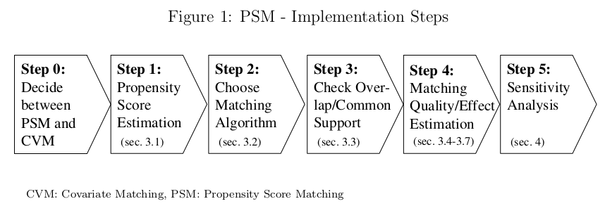

<script type="text/x-mathjax-config">
MathJax.Hub.Config({
  TeX: { 
      equationNumbers: { 
            autoNumber: "all",
            formatNumber: function (n) {return n}
      } 
  }
});
</script>


```{r setup, include=FALSE}
knitr::opts_chunk$set(echo = TRUE)
```

```{r inst, message=FALSE}
library(data.table)
library(fixest)
library(kableExtra)
library(modelsummary)
library(MatchIt)
library(ggplot2)
```

```{r dt-utils, echo=FALSE}
source("dt_utils.R")
```

```{r read, cache=TRUE}
dt <- fread("Data/cps_union_data.csv")
#' Cleaning.
dt[, c("V1", "CPSID", "CPSIDP", "public_housing", "employed") := NULL]
dt[, `:=`(
  marital_status = ifelse(marital_status %in% c(1, 2), 1, 0),
  race = ifelse(race == 1, 1, 0),
  age_2 = age^2
)]
cat_cols <- c("class_of_worker", "class_of_worker_last_year")
dt[, (cat_cols) := lapply(.SD, factor), .SDcols = cat_cols]
dt <- dt[complete.cases(dt)]
```

# Matching

Given that CIA holds and asserting that there is overlap between both groups (i.e. strong ignorability assumption), the Propensity Score Matching - PSM - estimator for ATT can be written as:

$$
\begin{equation}
\tau_{A T T}^{P S M}=E_{e(X) \mid D=1}\{E[Y(1) \mid D=1, e(X)]-E[Y(0) \mid D=0, e(X)]\}
\end{equation}
$$

where we draw the controls from a pool of untreated units and we aim to choose a subset such that its performance as a control group is better than the whole sample.

From @Caliendo2008 we have the following figure, depicting the steps for implementing a PSM estimation.

```{r psm-steps, echo=FALSE}

```

We are now at step 3, and need to choose an adequate matching algorithm. There are several ways to do this, we will outline some of the most used methods.

_Nearest neighbor matching_ (NNM) is a widely used method, and is composed of two steps. First, the algorithm sorts treated units in a specified order. Then, for each unit in the treatement group, the program finds one or more units in the control group with the nearest PS (or linearized PS). Matching with replacement means that after a treated unit is matched to another from the control group, the last is reintroduced to the control group for next-round matching.

It is worth noting the matching can be done based on the _Mahalanobis_ metric distance, which is **not** a method based on the PS. It plays a similar role as PS in assessing the similarities of different units in terms of the joint distribution of their covariates.

We will use the package `MatchIt` to perform PSM estimation[^matchit]. I suggest you thoroughly read the [package's website](https://kosukeimai.github.io/MatchIt/index.html), especially the articles. Let's estimate the ATT matching on the propensity score at the 1:1 ratio.

[^matchit]: A very nice article about the usage of `MatchIt` package and others in `R` is @ATM61857.

```{r ps-full}
#' Basic covariates
xb <- c("age", "age_2", "female", "race", "marital_status", 
        "veteran", "education", "class_of_worker")
#' Test covariates
xt <- c("private_health_insurance", "medicaid")
#' Model with full set of covariates!
fml <- paste0("union~(", paste(c(xb, xt), collapse = "+"), ")^2")
ps_full <- feglm(as.formula(fml), family = "binomial",
                data = dt[, c("union", ..xb, ..xt)])
# Include the PS into original data
dt[, `:=`(
  ps = predict(ps_full)
)]

# Matching units
psm_model <- matchit(as.formula(fml), method = "nearest",
                     data = dt[, c("earnings", "union", ..xb, ..xt)],
                     distance = dt$ps,
                     replace = FALSE,
                     m.order = "smallest",
                     ratio = 1)
psm_model
```
And we can access the matched data with the following command:

```{r ps-model}
dta <- match.data(psm_model)
head(dta[, c(1:2, 13:15)])
```

The `match.data` function returns the matched units, with all their original covariates, plus the columns distance, weights and subclass. Distance refers to the propensity score (or Mahalanobis if asked), weights and subclass refer to sample weights to be used in effect estimation and the "class" (i.e. block) that unit has been assigned. With this matched data in hand it is straightforward to estimate the ATT with a linear regression.

```{r psm-att}
psm_reg <- feols(earnings~union, data = dta, weights = ~weights)
etable(psm_reg, se = "hetero", keep = "union")
```

Adjustment for covariates inclusion is easily handled in this approach, you just include them on the linear regression. Also, CRVE may be used when necessary.

**If replacement** is used during the matching, you must use the `get_matches` function to get the matched data and use this in the linear regression. The standard errors should be computed using as clusters the subclass and unity id.

```{r replace}
# Avoiding get_matches bug
dt_gm <- dt[, c("earnings", "union", ..xb, ..xt)]
# Matching units
psm_rep <- matchit(as.formula(fml), method = "nearest",
                     data = dt_gm,
                     distance = dt$ps,
                     replace = TRUE,
                     m.order = "smallest",
                     ratio = 3)
# Get matched data
dtb <- get_matches(psm_rep)
head(dtb[, 1:5])
```

```{r replace2}
psm_rep_reg <- feols(earnings~union, data = dtb, weights = ~weights)
etable(psm_rep_reg, cluster = ~ subclass + id, keep = "union")
```

# Subclassification

Subclassification on the estimated propensity score is also refered as blocking or stratification. The sample is partitioned into subclasses (also referred to as strata or
blocks), based on the values of the estimated propensity scores, so that within the subclasses, the estimated propensity scores are approximately constant. 

The causal effects are estimated within each subclass as if assignment was completely at random within each subclass. If our sample is divided in $B$ blocks, then Imbens and Rubin suggest estimating treatment effects within each block, $\tau_{b}$, by fitting a linear model for each block $b=1,2 \ldots B$ :

$$
y_{i b}=\alpha_{b}+\tau_{b} W_{i b}+\gamma_{b}^{\prime} X_{i b}+\varepsilon_{i b}
$$

where $y_{i b}$ is the outcome of observation $i$ in block $b ;$ and $X_{i b}$ is an optional subset of covariates included. Blocking typically does not eliminate all biases associated with differences in the covariates, thus, remaining imbalances within each block can be accounted for if covariates are included. Second, these adjustments can improve the precision of estimators for causal effects.

After estimating the treatment effect within each block, we aggreate these as:

$$
\begin{equation}
\hat{\tau}=\sum_{b=1}^{B} \omega_{b} \hat{\tau}_{b}
\end{equation}
$$

where the weights depend on the estimand of interest. For the ATE, then $\omega_{b}=n_{b} / n$, where $n_{b}$ is the number of observations in block $b$. If we are interested in the average treatment effect on the treated (ATT), then $\omega_{b}=n_{b}^{t} / n^{t}$, where $n_{b}^{t}$ is the number of treated units in block $b$, and $n^{t}$ is the overall number of treated units.

## Creating the blocks

@Imbens2015 propose an algorithm to split the range of PS into $J$ blocks in order to estimate the causal effect through the subclassification method. We create intervals of the type $[b_{j−1} ,b_j)$ such that we analyze units with propensity scores
within an interval _as if_ they have identical propensity scores.

We start with a single block: $J = 1$, with boundaries equal to
$b_0 = 0$ and $b_j = b_1 = 1$ (if no trimming is selected). Then we have two steps. First we assess the adequacy of the current number of blocks by computing a t-statistic for the null hypothesis that the average value of the estimated **linearized propensity** score is the same for treated and control units.

$$
t_{\ell}(j)=\frac{\bar{\ell}_{t}(j)-\bar{\ell}_{c}(j)}{\sqrt{s_{\ell}^{2}(j) \cdot\left(1 / N_{\mathrm{c}}(j)+1 / N_{\mathrm{t}}(j)\right)}}
$$

Second, we check whether the number of controls and treated, $N_c(j)$ and $N_t(j)$, and the total number of units, $N(j)$, in each new block, would be greater than some minimum. If a block is not adequately balanced, and if splitting that block would lead to two new ones each with a sufficient number of units, then, we split at the median value and the new blocks are assessed for adequacy.

```{r blocking-fun}
#' Function that subdivides a given propensity score vector in sub-blocks
#' treat = vector with treatment assignments
#' ps = vector with propensity scores
#' K = how many covariates will we want to test/use in bias correction of 
#' estimates later on? 
#' t.max = threshold for tstat in making a further subdivide 
#' trim = should we discard extreme observations so there is overlap?
#' Author: Luis Alvarez
#' Modifications: Rafael F. Bressan
ps_blocks <- function(treat, ps, K, t.max = 1.96,  trim = FALSE)
{
  # Linearized propensity score function
  lps <- function(ps) {
    log(ps/(1 - ps))
  }
  
  if (trim) {
    b0 = min(ps[treat == 1])
    b1 = max(ps[treat == 0])
  } else
  {
    b0 = 0
    b1 = 1
  }
  b_vec = c(b0, b1)
  while (TRUE)
  {
    J <- length(b_vec) - 1
    b_vec_new <- do.call(c, lapply(1:J, function(j){
      sample <- (b_vec[j] <= ps) & (ps < b_vec[j + 1])
      
      ps.treat <- lps(ps[sample & treat == 1])
      ps.control <- lps(ps[sample & treat == 0])
      
      #print(length(ps.control))
      #print(length(ps.treat))
      
      t.test.pass <- tryCatch(
        {abs(t.test(ps.control, ps.treat)$statistic) > t.max}, 
        error = function(e){return(FALSE)}
        )
      
      med.val = median(c(ps.treat, ps.control))
      
      Nt.below = sum(ps.treat < med.val)
      Nt.above = sum(ps.treat >= med.val)
      Nc.below = sum(ps.control < med.val)
      Nc.above = sum(ps.control >= med.val)
      
      s.crit <- min(Nt.below, Nt.above, Nc.below, Nc.above) >= max(3, K + 2)
      
      if (t.test.pass & s.crit)
        return(c(b_vec[j], plogis(med.val), b_vec[j + 1])) 
      else return(c(b_vec[j], b_vec[j + 1]))
    })) # end of do.call
    
    b_vec_new = unique(b_vec_new)
    
    #print(length(b_vec_new))
    if (length(b_vec_new) == length(b_vec))
      break 
    else b_vec = b_vec_new
  } # end of while loop
  
  #Constructing blocking variable now
  block_var = rep(NA, length(treat))
  
  for (j in 1:(length(b_vec) - 1))
    block_var[(b_vec[j] <= ps) & (ps < b_vec[j + 1])] = j
  
  return(block_var)
}
```

```{r blocking, results = 'asis', warning=FALSE}
dt[, block := ps_blocks(union, ps, length(c(xb, xt)), 
                        t.max = 2.66,
                        trim = TRUE)]
#' Packing data into blocks
dt_block <- dt[!is.na(block), keyby = block,
               .(data = list(.SD))]
#' Balance tables by blocks
dt_block[, bal_tbl := lapply(data, balance_tbl, treat = "union")]
#' Check tables
lapply(dt_block$bal_tbl, balance_kbl)
```

```{r block-weights}
dt_block[, `:=`(N = sapply(data, nrow),
                Nt = sapply(data, function(x) sum(x$union)))]
dt_block[, `:=`(w = N/sum(N),
                wt = Nt/sum(Nt))]
dt_block[, estimates := lapply(data, function(x){
  reg <- feols(earnings~union, data = x)
  est <- coeftable(reg, se = "hetero")["union", c("Estimate", "Std. Error")]
  return(list(est[1], est[2]))
})]
# Unpack estimates
dt_block[, by = block, c("tau", "sigma") := estimates[[1]]]
bl_res <- dt_block[, .(
  estimand = c("ATE", "ATT"),
  Estimate = c(sum(tau*w), sum(tau*wt)),
  `Std. Error` = c(sqrt(sum(w^2 * sigma^2)), sqrt(sum(wt^2 * sigma^2)))
  )]
bl_res
```

Or, we can use the `MatchIt` package.

```{r block-m}
mS <- matchit(as.formula(fml), data = dt,
              method = "subclass", 
              distance = dt$ps,
              estimand = "ATT",
              subclass = 8,
              discard = "both")

dtc <- match.data(mS)
sub_reg <- feols(earnings~union, data = dtc, weights = ~weights)
etable(sub_reg, se = "hetero", keep = "union")
```

# Doubly-Robust

The basic Horvitz-Thompson (IPW) estimator exploits the following two equalities:


\begin{equation}
\mathbb{E}\left[\frac{Y_{i}\cdot W_{i}  }{e\left(X_{i}\right)}\right]=\mathbb{E}\left[Y_{i}(1)\right] \quad \text { and } \quad \mathbb{E}\left[\frac{Y_{i} \cdot\left(1-W_{i}\right) }{1-e\left(X_{i}\right)}\right]=\mathbb{E}\left[Y_{i}(0)\right]
\end{equation}

For ATE we have the following weighting scheme: 

$$\omega_{i}^{ate}=\frac{1}{e\left(X_{i}\right)^{W_{i}} \cdot\left(1-e\left(X_{i}\right)\right)^{1-W_{i}}}=\left\{\begin{array}{ll}
1 /\left(1-e\left(X_{i}\right)\right) & \text { if } W_{i}=0 \\
1 / e\left(X_{i}\right) & \text { if } W_{i}=1
\end{array}\right.$$

and for ATT the weights are slightly changed, 

$$\omega_{i}^{att}=\frac{1}{P[W_i=1]}\frac{e(X_i)^{1-W_i}}{\left(1-e\left(X_{i}\right)\right)^{1-W_{i}}}=\left\{\begin{array}{ll}
P[W_i=1]^{-1}\cdot e(X_i) /\left(1-e\left(X_{i}\right)\right) & \text { if } W_{i}=0 \\
P[W_i=1]^{-1} & \text { if } W_{i}=1
\end{array}\right.$$


Hence, our estimands are given by:

\begin{align}
\tau^{ATE}=\mathbb{E}\left[Y_{i}(1)-Y_{i}(0)\right]&=\mathbb{E}\left[\frac{Y_{i} \cdot W_{i}}{e(X_i)}-\frac{Y_{i} \cdot\left(1-W_{i}\right)}{1-e(X_i)}\right] \\
\tau^{ATT}=\mathbb{E}\left[Y_{i}(1)-Y_{i}(0) \mid W_{i}=1\right]&=\mathbb{E}\left[\frac{Y_{i} \cdot W_{i}}{\mathbb{P}\left[W_{i}=1\right]}-\frac{Y_{i} \cdot\left(1-W_{i}\right) \cdot e(X_i)}{\mathbb{P}\left[W_{i}=1\right]\left(1-e(X_i)\right)}\right]
\end{align}


and the estimator will be the sample counterpart, considering the estimated propensity score, $\hat e(X_i)$. It is useful to write this estimator as a weighted regression estimator. Take the model for $\tau^{ATE}$, for example. The regression specification and the weights are, respectively:

$$
\begin{align}
Y_i&=\alpha+\tau\cdot W_i+\varepsilon_i, \\
\omega_i &= \frac{W_i}{\hat e(X_i)}+\frac{1-W_i}{1-\hat e(X_i)}
\end{align}
$$
and it is easy to see that $\mathbb{E}[\hat\tau] = \tau^{ATE}$. This estimator can be modified easily to incorporate covariates. One can estimate a regression function that includes additional covariates the researcher believe help explain the outcome and use the same weights as before.

$$
\begin{align}
Y_i&=\alpha+\tau\cdot W_i+X_i\beta+\varepsilon_i \\
\end{align}
$$

This weighted regression estimator will be consistent for the true ATE as long as **either** the specification of the propensity score or the regression function is correct, yielding the property known as _double-robustness_.

```{r dr}
# Overall probability of treatment
p_treat <- mean(dt$union)
# Creating the weights
dt[, `:=`(w = union/ps + (1 - union)/(1 - ps),
          wt = (1/p_treat)*(ps/(1 - ps))^(1 - union))]
# ATE regression
reg <- feols(earnings~union+age+age_2+education+female, 
              data = dt, weights = ~w)
# ATT regression
reg2 <- feols(earnings~union+age+age_2+education+female, 
              data = dt, weights = ~wt)
etable(list(reg, reg2), se = "hetero", keep = "union")
```

# Useful links

[MatchIt website](https://kosukeimai.github.io/MatchIt/)

# References